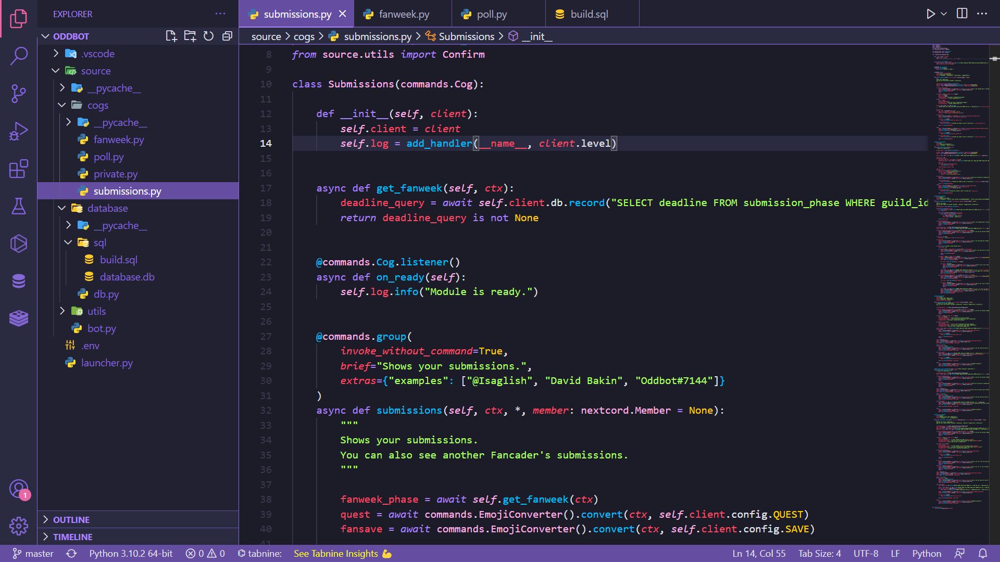
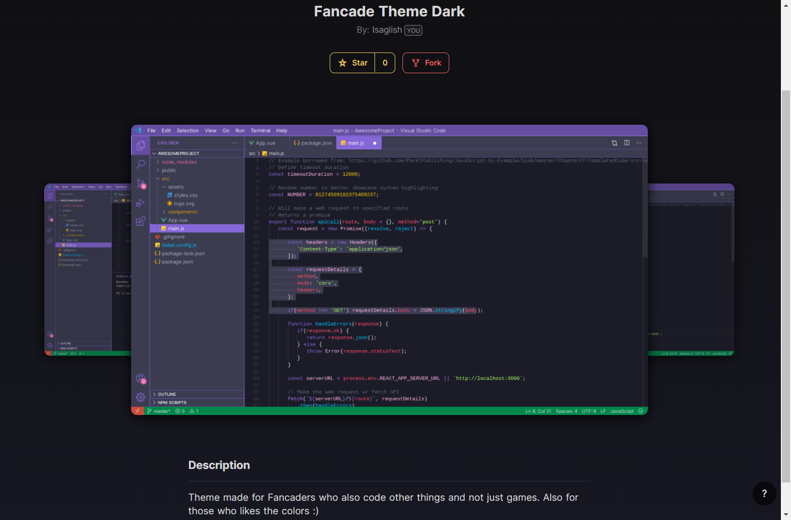
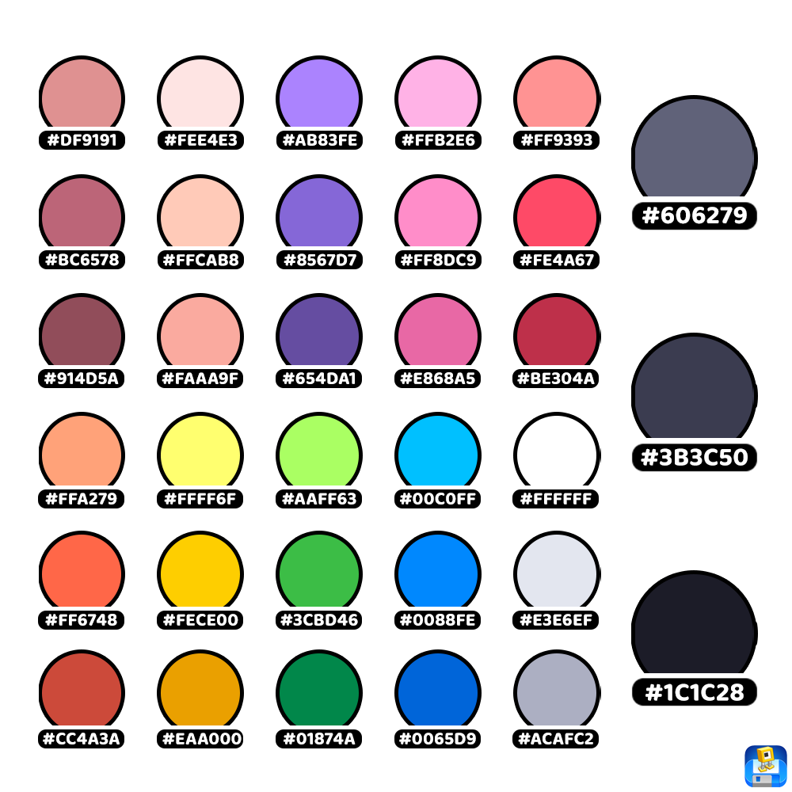

<h1 align="center">
     
    
     
     
    Fancade Theme Dark
     
     
</h1>

<h3 align="center">Theme inspired by the application <a href="https://play.fancade.com"><b>Fancade.</b></a></h3>

    
    
    
    
    

<h4 align="center">I made this theme because I really liked the colors of Fancade and since I use it most of the time, why not put its colors on another application I will be using a lot? I really like the purple and how it came out, hope you enjoy using this theme.</h4>
 
 

## Theme Screenshots

 
 

 
 

## Fancade Palette

