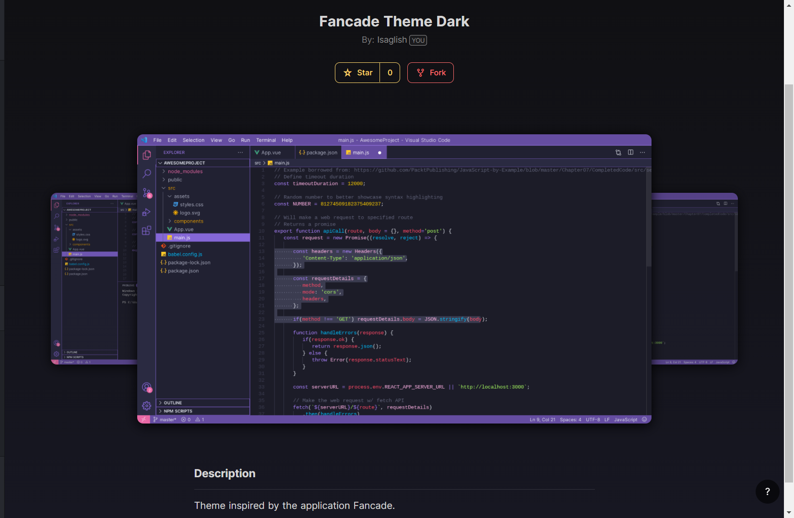

<h1 align="center">
     
    
     
     
    Fancade Theme Dark
     
     
</h1>

<h3 align="center">Theme inspired by the application <a href="https://play.fancade.com"><b>Fancade.</b></a></h3>

     <a itemprop='url' href=https://www.fiverr.com/isaglish rel="nofollow" target="_blank" style='display: inline-block;'>
        

        

            
isaglish

            
Fiverr

            
Seller

            
Hi, there! I am a teenager who has been interested in coding because of the challenges and accomplishments it gives me, there's just something satisfying with problem-solving. I like to play video games- who doesn't like video games? I occasionally play basketball too. I am a self-taught programmer, I began coding as a hobby in late 2019 and has made quite a few games in Fancade and a few discord bots both for personal use and friends. My main language is Python.

        

    </a>

    
    
    
    
    

<h4 align="center">I made this theme because I really liked the colors of Fancade and since I use it most of the time, why not put its colors on another application I will be using a lot? I really like the purple and how it came out, hope you enjoy using this theme.</h4>
 
 

## Theme Screenshots

 
 

 
 

## Fancade Palette

